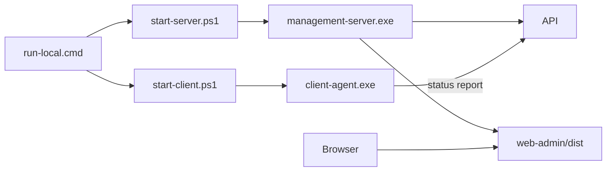

# 一键运行与首次设置向导设计

## 阶段边界
P10 目标是降低首次运行成本，让本机包能用一个入口跑起 Server、Client 和 Web Admin，并在 Web Admin 中展示首次设置向导。

## 当前实现
| 项目 | 设计 |
|------|------|
| 目标版本 | v1.4.0 |
| 一键入口 | `tools/run-local.cmd` |
| Server 脚本 | `tools/start-server.ps1` |
| Client 脚本 | `tools/start-client.ps1` |
| Web 托管 | `MANAGEMENT_SERVER_WEB_DIR` 指向 `web-admin/dist` |
| 设置向导 | Web Admin `SetupWizardPanel.vue` |
| 设置保存 | 浏览器 localStorage |
| DM 边界 | x64 核心模式与 x86 DM 模式分开提示 |

## 一键运行数据流

## Management Server Web 托管
- `MANAGEMENT_SERVER_WEB_DIR` 配置静态目录。
- API 路由仍优先匹配。
- 未命中 API 的路径由静态目录处理。
- SPA 路径回退到 `index.html`。

## 首次设置向导
向导只做本地配置辅助，不直接写 Client 配置文件，也不下发远程命令。

当前字段：
- Server Host。
- Server Port。
- Client ID。
- JSONL 历史文件路径。
- Web Admin dist 目录。
- Client 模式：x64 核心模式 / x86 DM 模式。
- DmBridge 路径。
- 是否启用 Client 上报。

## x86 / x64 边界
- x64 Client：用于基础状态、Lua bootstrap、Server 上报和 Web Admin。
- x86 Client：用于后续 32 位大漠、Win32 DmBridge 和 `dm.dll`。
- x64 Server 可以接收 x86 Client 上报。
- 发布包不包含大漠 `dm.dll`、`RegDll.dll`、授权资料和 CHM/CHW。

## 生产前置项
- 一键脚本当前是本机开发/试运行入口，不是 Windows Service。
- 后续如需长期驻留，应另做 Service、托盘、日志轮转和自动升级设计。
- 首次设置向导当前只保存浏览器本地状态，后续如需真正写配置文件，需要新增受控本地配置 API。
