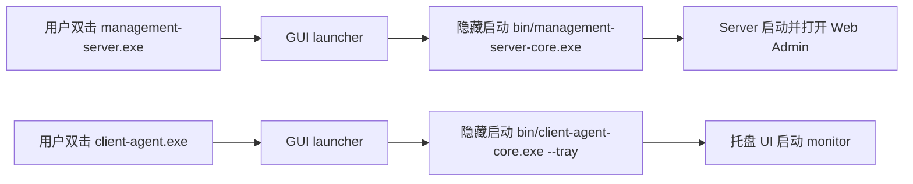

# 无控制台正式入口与安装器设计

## 阶段目标
P15 将发布形态从“核心 exe 可双击”升级为“普通 Windows 软件入口”：用户双击根目录 exe 时不再看到命令行窗口，并可通过当前用户安装器创建快捷方式。

## 设计原则
- 不重写 P13/P14 已完成能力。
- 核心程序继续保留命令行维护入口。
- 普通用户入口与维护入口分离。
- 安装不需要管理员权限。
- 不复制、不注册、不上传大漠私有文件。

## 发布包结构
| 路径 | 类型 | 职责 |
|------|------|------|
| `management-server.exe` | GUI launcher | 隐藏启动 `bin/management-server-core.exe` |
| `client-agent.exe` | GUI launcher | 隐藏启动 `bin/client-agent-core.exe --tray` |
| `WoW-Manager.exe` | GUI launcher | 调用当前用户安装脚本并创建快捷方式 |
| `WoW-Remove.exe` | GUI launcher | 调用当前用户卸载脚本 |
| `bin/management-server-core.exe` | 核心 exe | Server 实际运行程序，保留维护参数 |
| `bin/client-agent-core.exe` | x86 核心 exe | Client 实际运行程序，兼容 32 位大漠 |
| `bin/client-agent-x64-core.exe` | x64 核心 exe | 无 DM 场景下的 x64 Client 维护入口 |
| `installer/` | 安装脚本 | 当前用户安装、卸载和快捷方式管理 |

## 启动流程

## 开机启动衔接
Client core 位于 `bin` 目录时，开机启动不能写入 `bin/client-agent-core.exe`。P15 调整为：如果当前进程是 `client-agent-core.exe`，且包根目录存在 `client-agent.exe`，则 HKCU Run 写入根目录 launcher。

## 安装器边界
当前用户安装器执行以下动作：
- 将发布包复制到 `%LOCALAPPDATA%\WoWFramework`。
- 创建桌面快捷方式 `WoW Server`、`WoW Client`。
- 创建开始菜单目录 `WoW Framework`。
- 卸载时删除程序文件和快捷方式。
- 保留 `data` 和 `logs`，避免误删运行记录。

## 未纳入范围
- MSI / MSIX 安装包。
- 管理员级全局安装。
- 自动更新运行中自替换。
- Service 自动安装和提权。
- 大漠 `dm.dll`、`RegDll.dll` 注册。
