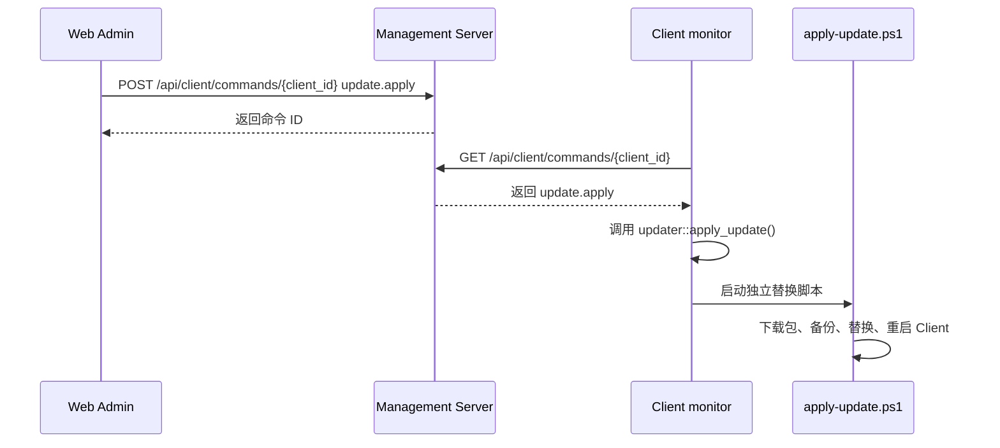

# 服务端远程更新与导航补全设计

## 目标
P17 将 v1.10.0 已完成的自替换更新能力接入 Server 远程命令，并补齐 Web Admin 左侧导航功能页，避免用户依赖命令行入口完成日常操作。

## 影响评估
- 是否影响旧结构：否。继续复用 P13 命令队列、P16 updater 和 P15 GUI launcher。
- 是否影响已完成任务：否。旧 CLI 维护入口保留，正式入口改由 Web Admin 页面触发。
- 是否需要兼容处理：是。新增命令只作为白名单扩展，不改变已有命令语义。

## 模块边界
| 模块 | 职责 | 本次调整 |
|------|------|----------|
| `management-server` | 保存状态、消息和命令队列 | 增加 `update.apply` 白名单；查询最新状态时按心跳窗口收敛在线状态 |
| `client-agent` | 上报状态、轮询消息和命令 | 执行 `update.apply` 时调用现有自替换更新器 |
| `web-admin` | 正式管理入口 | 左侧导航切换真实页面；远程操作页下发更新、Service、开机启动和本机窗口命令 |

## 远程更新流程

## 在线状态收敛
Server 内存中仍保存 Client 最后一次上报原始快照。`GET /api/client/status` 和 `GET /api/client/status/{client_id}` 输出时，如果最后上报时间超过 60 秒，则把 `online` 标记为 `false`。

这样不会改写历史样本，也不会破坏 P8 历史趋势；只解决 Web 管理端看到旧快照长期“在线”的问题。

## Web 导航页面
| 页面 | 功能 |
|------|------|
| 总览 | Server 健康、在线统计、脚本、安全门、最近上报、快照和趋势 |
| 客户端 | Client 列表、历史趋势、状态详情 |
| 脚本 | 当前脚本、bootstrap、安全门、允许权限和脚本 JSON |
| 远程操作 | Server 消息、安装更新、检查更新、下载更新、Service、开机启动、设置窗口、日志、托盘 |
| 设置 | 首次设置向导、本地连接设置、Server 状态 |

## 风险与边界
- `update.apply` 会在 Client 本机安排替换脚本，可能停止当前 monitor，这是预期行为。
- 当前命令队列仍为内存队列，未做鉴权、审计、送达确认；后续 P18 需要补。
- 在线状态阈值为 60 秒，低于生产级心跳策略；后续应改为 Server 可配置项。
- Web Admin 仍是本地管理端定位，生产部署前必须补登录鉴权和 CORS 白名单。

## 验证方式
- `cargo fmt --all --check`
- `cargo test --workspace`
- `cargo clippy --workspace -- -D warnings`
- `npm run build`
- 包内 Server/Client 烟测：远程下发 `update.apply` 可被 Client 轮询执行。
