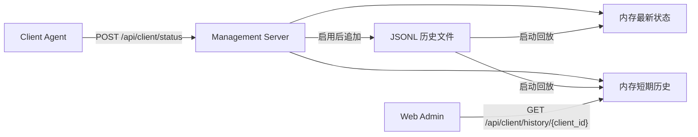

# 生产持久化设计

## 阶段边界
P9 固定为生产持久化的第一步：先让 Management Server 的状态历史具备可恢复能力，再沉淀后续 SQLite/Postgres 的正式迁移设计。

## 当前实现
| 项目 | 设计 |
|------|------|
| 目标版本 | v1.3.0 |
| 当前存储 | 可选 JSONL 文件 |
| 启用方式 | `MANAGEMENT_SERVER_HISTORY_PATH` |
| 默认行为 | 不配置时保持 P8 纯内存状态 |
| 保存对象 | `WsEnvelope<ClientStatus>` |
| 启动恢复 | Server 启动时从 JSONL 回放最新状态和历史队列 |
| 历史上限 | 每个 Client 仍保留最近 50 条到内存 API |

## 为什么先用 JSONL
- 不引入数据库驱动，避免 P9 直接扩大依赖面。
- 一行一条状态，便于追加、备份、审查和排查坏数据。
- 不改变 P8 API，Web Admin 无需改动。
- 可作为后续 SQLite/Postgres 导入源。

## 当前数据流


## JSONL 格式
每行保存一个完整 `WsEnvelope<ClientStatus>` JSON 对象。

## SQLite/Postgres 后续 schema
P9 不直接引入数据库，但固定后续正式 schema 方向：

```sql
create table client_status_events (
  id bigserial primary key,
  client_id text not null,
  message_id text not null,
  timestamp_ms numeric(20, 0) not null,
  online boolean not null,
  current_script text,
  release_version text not null,
  os text not null,
  arch text not null,
  process_id integer not null,
  bootstrap_name text not null,
  instruction_limit integer not null,
  security_enabled boolean not null,
  allowed_permissions jsonb not null,
  report_enabled boolean not null,
  report_target text not null,
  raw_envelope jsonb not null,
  created_at timestamptz not null default now()
);

create unique index client_status_events_message_id_idx
  on client_status_events (message_id);

create index client_status_events_client_time_idx
  on client_status_events (client_id, timestamp_ms desc);
```

## 保留策略
- JSONL MVP：不自动删除文件，由部署侧定期备份和归档。
- SQLite/Postgres：保留原始事件 30 天，聚合指标后可归档。
- Web API 内存窗口继续限制为每个 Client 最近 50 条，避免页面一次拉取过大。

## 备份恢复
- JSONL：关闭 Server 后复制历史文件即可备份。
- 恢复时将备份文件路径配置到 `MANAGEMENT_SERVER_HISTORY_PATH`，Server 启动会自动回放。
- 数据库阶段需要增加迁移脚本、定时备份、恢复演练和坏数据隔离。

## 安全边界
- JSONL 可能包含机器名、脚本名、版本和上报目标，不允许提交到 GitHub。
- `.gitignore` 已忽略 `data/` 和 `*.jsonl`。
- P9 仍未包含鉴权、TLS、生产 CORS、审计、账号体系和远程脚本下发。
