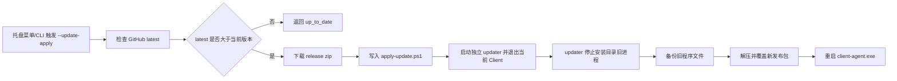

# 自动更新自替换设计

## 阶段目标
P16 补齐自动更新闭环：Client 从 GitHub Release 检查新版、下载发布包，并通过独立 updater 脚本在当前进程退出后替换安装目录。

## 设计原则
- 不改 P15 发布包入口结构。
- 不在运行中的 core exe 内直接覆盖自身。
- 更新前保留备份。
- 保留 `data`、`logs`、`updates`，避免删除运行数据。
- 只从 GitHub Release 下载 `WoW_Framework*.zip`。

## 更新流程

## 文件边界
| 路径 | 职责 |
|------|------|
| `%LOCALAPPDATA%\WoWFramework\updates` | 下载包、apply 脚本和备份目录 |
| `logs/update-apply.log` | updater 执行日志 |
| `data/` | 运行数据，更新时保留 |
| `logs/` | 运行日志，更新时保留 |
| `updates/` | 更新缓存和备份，更新时保留 |

## 命令入口
| 命令 | 职责 |
|------|------|
| `--update-check` | 只查询最新版本 |
| `--update-download` | 下载最新发布包 |
| `--update-apply` | 检查新版、下载并安排自替换 |

## 未纳入范围
- MSI/MSIX 安装器。
- 发布包签名验证。
- 增量补丁。
- Service 提权更新。
- 多机器灰度发布。
