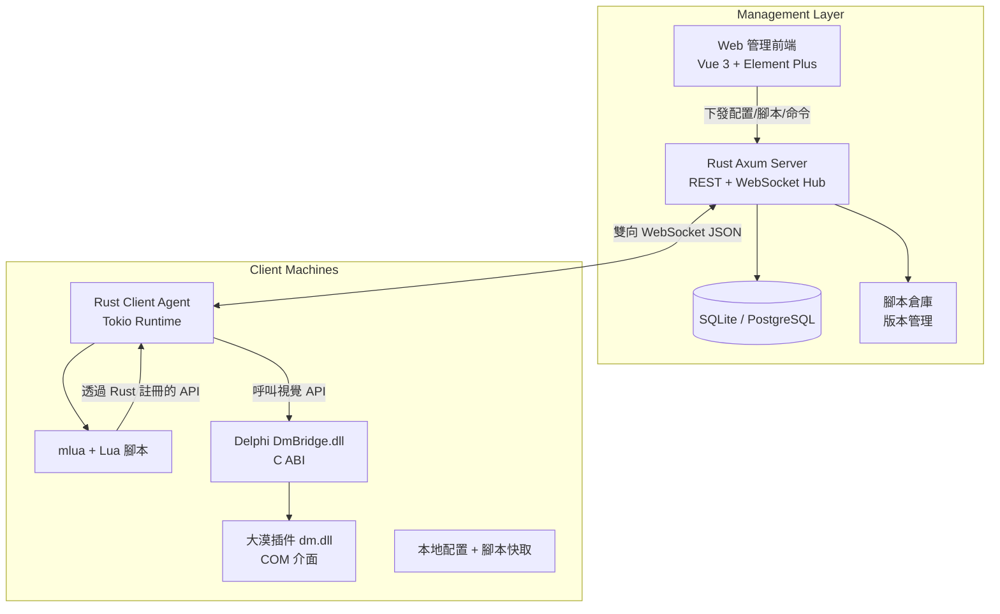

# Rust + Lua + 大漠 客戶端腳本框架 + Web 管理平台
## 開發文檔 v0.1（規劃與設計版）

**項目代號**：RLAF（Rust Lua Automation Framework）  
**版本**：v0.1  
**日期**：2026-07-05  
**作者**：Grok 為 KUN 規劃  
**目標受眾**：獨立開發者 / 自動化工具開發者（尤其是中國開發者社群）  
**核心理念**：一個**通用、可重用、高性能、安全**的 Windows 自動化代理框架，支援遠端集中管理多台客戶端，Lua 作為業務腳本語言，大漠插件作為圖色識別核心。

---

## 1. 項目概述

### 1.1 背景與目標
你需要一個**客戶端框架**，能：
- 在目標 Windows 機器上穩定運行
- 使用 Lua 編寫業務邏輯（找圖、點擊、鍵盤、流程控制等）
- 透過 Rust 提供乾淨、安全、高性能的 API 給 Lua（包含大漠圖色識別）
- 透過 Web 管理平台集中配置、監控、控制所有客戶端腳本狀態

**最終目標**：打造一個**可重複使用**的自動化代理基礎設施，適用於遊戲輔助、RPA、測試自動化、監控報警等多種圖像識別類腳本項目。

### 1.2 核心價值
- **通用性**：框架成型後可快速適配不同圖像識別/自動化項目，只需更換 Lua 腳本集 + 配置模板。
- **可維護性**：Rust 核心安全 + Lua 業務靈活 + Web 集中管理。
- **可擴展性**：大漠可替換為其他視覺引擎（OpenCV、Tesseract、自研模型等）。
- **生產就緒**：心跳、斷線重連、錯誤恢復、熱更新、權限控制。

### 1.3 非目標（MVP 階段先不做）
- 複雜本地 GUI（後期可用 Tauri 補充）
- 分散式任務調度（後期可加）
- 多視覺引擎同時運行（先專注大漠）

---

## 2. 整體架構設計

### 2.1 架構圖（Mermaid）



### 2.2 資料流
1. Client 啟動 → 驗證 + 建立 WebSocket → 上報基礎資訊 + 心跳
2. Server 推送最新配置 + 腳本清單
3. Client 載入/更新 Lua 腳本
4. Lua 執行時呼叫 `dm.find_pic` 等 Rust 註冊函數 → 轉發到 DmBridge → 大漠 COM
5. 執行結果、狀態、錯誤實時上報 Server
6. Web 端即時看到所有 Client 狀態，一鍵控制

---

## 3. 技術棧（最終推薦）

| 層級           | 技術選型                          | 理由 |
|----------------|-----------------------------------|------|
| **Client Core** | Rust + Tokio + mlua (lua54)      | 高性能、安全、優秀的 Lua FFI、異步網路 |
| **視覺橋接**    | Delphi 13 DLL（C ABI 導出）      | 大漠 COM 整合最簡單穩定，後期可遷移純 Rust |
| **Server**     | Rust + Axum + sqlx + WebSocket   | 統一 Rust 生態、輕量、高併發 |
| **前端**       | Vue 3 + Vite + Tailwind + Element Plus | 你正在學習，中文生態好，開發快 |
| **通訊**       | WebSocket + JSON（後期可換 bincode） | 即時雙向、低延遲 |
| **配置**       | TOML + JSON                      | 易讀易寫 |
| **日誌**       | tracing + tracing-subscriber     | 結構化日誌，方便排查 |
| **打包**       | cargo build --release + upx      | 單一 exe，方便分發 |

---

## 4. 模組劃分與職責

### 4.1 Client Agent（rust-lua-agent）
- **main.rs**：啟動、初始化、連線 Server
- **lua_host.rs**：建立 mlua 實例、註冊所有 Rust 函數給 Lua、腳本生命週期管理
- **dm_bridge.rs**：透過 `libloading` 呼叫 Delphi DLL 提供的 C 函數
- **comm.rs**：WebSocket 客戶端、心跳、命令處理、狀態上報
- **config.rs**：載入/熱更新本地配置
- **script_manager.rs**：下載/驗證/載入/熱重載 Lua 腳本
- **status.rs**：收集系統資訊、腳本執行狀態

### 4.2 DmBridge（Delphi 13 DLL）
- 負責免註冊載入大漠
- 導出核心函數：`FindPic`, `FindColor`, `GetColor`, `MoveTo`, `LeftClick`, `SendString` 等
- 處理 COM 執行緒模型（STA）
- 提供簡單錯誤碼返回

### 4.3 Management Server（rust-management-server）
- REST API：客戶端註冊、配置下發、腳本上傳、命令推送
- WebSocket Hub：即時狀態廣播、命令通道
- DB Schema：clients, scripts, client_scripts, logs, configs
- Auth：Client API Key + Admin JWT

### 4.4 Web Admin（web-admin）
- 儀表板：所有客戶端狀態卡片（線上/離線、當前腳本、CPU/記憶體可選）
- 客戶端詳情：即時日誌、配置編輯器
- 腳本庫：上傳、版本、指派給客戶端/群組
- 命令面板：一鍵啟動/停止/重載/更新配置

---

## 5. 通訊協議與介面契约（v0.1 簡版）

### 5.1 WebSocket 訊息格式（JSON）

**Client → Server（上報）**
```json
{
  "type": "heartbeat" | "status" | "log" | "result",
  "client_id": "uuid-string",
  "timestamp": 1720xxxxxx,
  "data": { ... }
}
```

**Server → Client（命令）**
```json
{
  "type": "command",
  "command": "start_script" | "stop_script" | "reload_script" | "update_config" | "update_script",
  "payload": { ... }
}
```

### 5.2 Lua 側 API 規範（Rust 註冊給 Lua）

目標：提供**高層、易用、安全**的介面，而不是裸露大漠所有方法。

```lua
-- 基礎
log("訊息")                    -- Rust 側結構化日誌
sleep(1000)                    -- 安全 sleep（可中斷）
get_config("key")              -- 讀取動態配置
report_progress(50, "執行中...") -- 上報進度

-- 視覺（dm 模組）
local x, y = dm.find_pic(0, 0, 1920, 1080, "login.bmp", 0.85)
if x >= 0 then
    dm.move_to(x, y)
    dm.left_click()
end

local color = dm.get_color(100, 200)
dm.find_color(0,0,1920,1080, "FFFFFF-000000", 1.0)

-- 高層封裝（推薦在 Lua 層或 Rust 層提供）
dm.wait_for_pic("button.bmp", 5000)  -- 等待圖片出現
dm.click_pic("ok.bmp")               -- 找圖 + 點擊
```

**Rust 側註冊原則**：
- 所有可能失敗的操作返回 `LuaResult`（轉成 Lua error）
- 提供 `pcall` 友好版本
- 重要操作記錄 tracing span
- 後期可加權限白名單

---

## 6. 開發路線圖（分階段，建議順序）

### Phase 0：基礎建設（1 天）
- [ ] 建立 monorepo 目錄結構
- [ ] 初始化 4 個子專案（client-agent, dm-bridge, management-server, web-admin）
- [ ] 定義 client_id 生成規則 + API Key 機制
- [ ] 建立共用 types crate（serde 結構體）

### Phase 1：Client Lua 宿主 + 基礎通訊（4-6 天）**最重要**
- [ ] 完成 mlua 初始化 + 註冊 log / sleep / get_config
- [ ] 實現 WebSocket 連線 + 心跳 + 簡單命令接收
- [ ] 實現 script_manager（從本地載入 + 記憶體執行）
- [ ] 完成第一個可運行的 Lua 測試腳本

**里程碑**：Client 能連上 Server，並執行簡單 Lua 腳本。

### Phase 2：大漠橋接整合（5-7 天）
- [ ] Delphi 13 建立 DmBridge.dll 專案
- [ ] 實現免註冊載入 + 導出 5-8 個核心函數（FindPic, GetColor, MoveTo, LeftClick 等）
- [ ] Rust 側 libloading 呼叫 + 錯誤處理
- [ ] 在 Lua 側暴露 `dm` 表

**里程碑**：Lua 腳本能真正呼叫大漠找圖並移動滑鼠。

### Phase 3：Server 核心 + WebSocket Hub（4-5 天）
- [ ] Axum 專案 + WebSocket 支援
- [ ] 簡單 SQLite schema + sqlx
- [ ] Client 註冊、心跳處理、狀態儲存
- [ ] 基本 REST API（/clients, /commands）

**里程碑**：Server 能管理多個 Client 狀態。

### Phase 4：Web 管理前端 MVP（4-6 天）
- [ ] Vite + Vue 3 + Element Plus 專案
- [ ] 客戶端列表 + 狀態卡片（即時更新 via WS）
- [ ] 簡單配置編輯 + 下發
- [ ] 即時日誌面板

**里程碑**：能在瀏覽器看到所有 Client 狀態並下發命令。

### Phase 5：完整控制閉環 + 腳本管理（5-7 天）
- [ ] 腳本上傳、版本管理、指派給 Client
- [ ] Lua 腳本熱重載機制
- [ ] 錯誤恢復 + 自動重啟策略
- [ ] 配置熱更新（Lua 側可即時讀取最新 config）

**里程碑**：完整從 Web 端控制 Client 執行不同腳本。

### Phase 6：生產化與擴展（持續）
- [ ] Client 做成 Windows Service + 托盤圖示
- [ ] 權限模型 + 腳本沙箱
- [ ] 日誌聚合 + 告警（企業微信/飛書）
- [ ] 視覺引擎插件化（為未來替換大漠做準備）

---

## 7. 詳細設計要點

### 7.1 Lua 腳本生命週期
1. Server 下發腳本內容或路徑
2. Client 寫入本地快取目錄（`scripts/<script_id>.lua`）
3. `script_manager` 載入到獨立 Lua state（推薦每個腳本獨立 state，避免污染）
4. 執行 `main()` 或直接執行
5. 支援 `coroutine` 做長時間任務
6. 停止時呼叫清理函數（如果腳本提供）

### 7.2 配置管理策略
- **三層配置**：全域配置（Server） → Client 專屬配置 → 腳本內部配置
- Lua 側暴露 `config.get("section.key")` 
- Server 下發配置時，Client 熱更新並通知 Lua（透過 registry 或 channel）

### 7.3 錯誤處理與恢復
- Rust 側所有公開函數都用 `Result`，錯誤轉成 Lua error + 上報 Server
- 腳本崩潰 → 記錄堆疊 + 自動重啟（可配置次數）
- 網路斷線 → 本地繼續執行 + 重連後同步狀態

### 7.4 安全考量（重要）
- Lua 預設禁用危險模組（`os.execute`, `io.popen`, `require "ffi"` 等）
- 只允許白名單函數
- 腳本上傳需 Admin 審核或簽名（後期）
- Client API Key 定期輪換

---

## 8. 部署與打包建議

**Client**：
- `cargo build --release`
- 靜態連結或打包 `lua54.dll` + `DmBridge.dll` + `dm.dll` + `dmreg.dll`
- 做成單一資料夾分發，或用 Inno Setup 做安裝包
- 建議以 Windows Service 方式運行（用 `windows-service` crate）

**Server**：
- Docker 化（推薦）
- 或直接在 Windows/Linux VPS 運行

**前端**：
- `npm run build` 後用 Nginx / Caddy 靜態託管

---

## 9. 框架可重用性說明（回答你的問題）

**是的！這個框架成型後具有極高的通用性，可以運用到幾乎任何「圖像識別 + 自動化腳本」項目中。**

### 為什麼可重用？

1. **核心是「通用自動化代理」**，而非針對單一業務。
   - Rust + mlua 提供穩定的腳本執行環境
   - 大漠（或其他視覺引擎）提供圖色能力
   - WebSocket + 管理平台提供遠端控制能力

2. **業務邏輯完全在 Lua 腳本層**：
   - 不同項目只需開發/替換不同的 Lua 腳本集
   - 例如：
     - 項目A：某網頁遊戲輔助（找圖 + 自動戰鬥）
     - 項目B：企業內部 ERP 系統 RPA（找按鈕 + 填表 + 匯出報表）
     - 項目C：監控大屏異常報警 + 自動截圖上傳

3. **視覺引擎可插拔**（後期架構優勢）：
   - 目前用大漠
   - 未來可輕鬆替換為 OpenCV + Rust 實作、Windows Graphics Capture、甚至本地 LLM 視覺模型
   - 只需修改 `dm_bridge` 層或加新 bridge

4. **管理平台支援多項目**：
   - 可在 Server 增加「Project / Script Repository」概念
   - 一個 Client 可同時運行多個不同項目的腳本（或切換）
   - 配置模板可重用

### 如何適配新項目（典型流程）

1. 在 Web 管理端建立新「腳本庫」或「項目」
2. 上傳該項目專用的 Lua 腳本（可帶圖片資源）
3. 為目標 Client 指派該腳本 + 配置
4. Client 自動下載並執行
5. 如需新視覺功能，在 Rust 或 Delphi Bridge 新增對應函數即可

**結論**：這個框架**不是一次性工具**，而是**可重複使用的自動化基礎設施**。你以後開發任何新的圖像識別類腳本項目，都可以直接複用這套 Agent + 管理平台，大幅降低重複開發成本。

---

## 10. 下一步行動建議

1. **立即開始**：按照 Phase 0 + Phase 1 建立專案結構並跑通第一個 Lua + WebSocket 範例。
2. **我可以立刻提供**：
   - 完整 monorepo 目錄結構 + 各 Cargo.toml
   - Phase 1 完整可編譯的 client-agent 程式碼
   - Delphi DmBridge DLL 範例專案結構與核心程式碼
   - Axum Server WebSocket Hub 骨架
   - Vue 管理前端頁面原型建議

請告訴我：
- 你想先從哪個 Phase 開始？
- 是否需要我現在就生成 **完整可直接使用的初始程式碼專案**（包含所有 starter code）？

這個框架一旦成型，將成為你未來所有自動化項目的堅實底座，與你的 REL IDE 理念高度契合。

準備好開始 coding 了嗎？我們一步一步把它做出來！🚀

---

**附錄**：參考資源
- mlua 官方文件
- Axum WebSocket 示例
- Delphi 免註冊呼叫大漠經典範例
- windows-rs COM 相關討論（後期純 Rust 遷移用）

**版本歷史**  
v0.1 - 2026-07-05 初始完整規劃版（含架構、路線圖、可重用性分析）